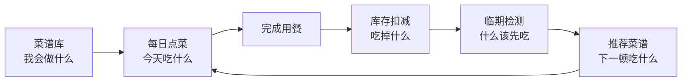

# 今天吃什么｜Android App V1（Kotlin）

> **食谱 × 三餐 × 库存 × 临期提醒 × 智能推荐**

这是“今天吃什么”Android App 的 **Kotlin 第一版产品与技术基线**。本版本在前一版产品设计基础上重新梳理，并针对 Kotlin Android 开发进行了架构和数据模型调整。

## 一句话定位

> 不是简单的菜谱记录工具，而是帮助用户决定“今天吃什么”，并优先把家里的食材吃掉。

## 核心闭环



## V1 核心原则

1. **首页优先解决“今天吃什么”。**
2. **菜谱是点菜的数据源。**
3. **库存是推荐的依据，而不是点菜的硬限制。**
4. **完成用餐后支持半自动扣库存。**
5. **临期食材进入首页，并参与推荐。**
6. **V1 本地优先，不强制登录。**
7. **Kotlin + Jetpack Compose + Room + ViewModel + Repository + UseCase。**
8. **所有 UI 颜色、文字、间距、圆角使用统一 Design Tokens。**

## 文档目录

| 文件 | 内容 |
|---|---|
| `docs/PRD.md` | 完整产品需求文档 |
| `docs/PAGES.md` | 页面结构与页面原型说明 |
| `docs/FLOWS.md` | 用户流程与核心业务流程 |
| `docs/DATABASE_ER.md` | Room 数据库 ER 结构与实体设计 |
| `docs/ARCHITECTURE.md` | Kotlin Android 技术架构与模块设计 |
| `docs/UI_DESIGN.md` | 紫渐变 UI 设计系统与 Design Tokens |
| `docs/ROADMAP.md` | 开发阶段、MVP 范围与验收标准 |
| `assets/app_ui_prototype.png` | 页面原型/功能架构视觉参考图 |

## 目录结构

```text
今天吃什么_App_V1_Kotlin_Markdown/
├── README.md
├── assets/
│   └── app_ui_prototype.png
└── docs/
    ├── PRD.md
    ├── PAGES.md
    ├── FLOWS.md
    ├── DATABASE_ER.md
    ├── ARCHITECTURE.md
    ├── UI_DESIGN.md
    └── ROADMAP.md
```

## 推荐 Android 技术栈

```text
Kotlin
├── Jetpack Compose      UI
├── Navigation           页面导航
├── ViewModel            页面状态
├── StateFlow            UI 状态流
├── Room                 本地数据库
├── Kotlin Coroutines    异步任务
├── Repository           数据访问抽象
├── UseCase              核心业务逻辑
└── WorkManager          临期提醒等后台任务
```

## V1 验收闭环

```text
新增菜谱
  ↓
录入番茄炒蛋：番茄 2 个、鸡蛋 3 个
  ↓
录入库存：番茄 4 个、鸡蛋 8 个
  ↓
首页 → 午餐 → 添加“番茄炒蛋”
  ↓
完成用餐
  ↓
确认实际消耗：番茄 -2、鸡蛋 -3
  ↓
库存自动更新
  ↓
发现番茄明天过期
  ↓
首页出现临期提醒
  ↓
点击“优先安排”
  ↓
推荐能够消耗番茄的菜谱
```
