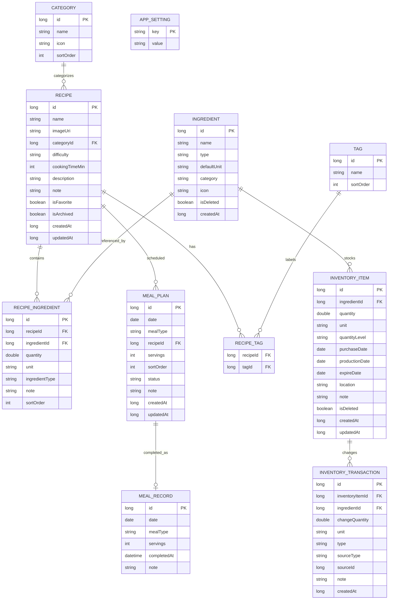

# 04｜Room 数据库 ER 结构

## 1. 设计原则

1. `Ingredient` 与 `InventoryItem` 分离。
2. `Recipe` 与食材通过关联表连接。
3. 库存所有变化必须进入流水表。
4. 计划用餐 `MealPlan` 与实际用餐 `MealRecord` 分离。
5. 删除优先使用归档/软删除。
6. 日期使用 `LocalDate` / `LocalDateTime` 的业务语义层，Room 中落库时统一转换为可查询格式。

## 2. ER 图



## 3. Entity 设计

### 3.1 RecipeEntity

```kotlin
@Entity(tableName = "recipe")
data class RecipeEntity(
    @PrimaryKey(autoGenerate = true)
    val id: Long = 0,
    val name: String,
    val imageUri: String? = null,
    val categoryId: Long? = null,
    val difficulty: String = "EASY",
    val cookingTimeMin: Int? = null,
    val description: String? = null,
    val note: String? = null,
    val isFavorite: Boolean = false,
    val isArchived: Boolean = false,
    val createdAt: Long,
    val updatedAt: Long
)
```

### 3.2 IngredientEntity

```kotlin
@Entity(tableName = "ingredient")
data class IngredientEntity(
    @PrimaryKey(autoGenerate = true)
    val id: Long = 0,
    val name: String,
    val type: String,
    val defaultUnit: String? = null,
    val category: String? = null,
    val icon: String? = null,
    val isDeleted: Boolean = false,
    val createdAt: Long
)
```

### 3.3 RecipeIngredientEntity

```kotlin
@Entity(
    tableName = "recipe_ingredient",
    foreignKeys = [
        ForeignKey(
            entity = RecipeEntity::class,
            parentColumns = ["id"],
            childColumns = ["recipeId"],
            onDelete = ForeignKey.CASCADE
        ),
        ForeignKey(
            entity = IngredientEntity::class,
            parentColumns = ["id"],
            childColumns = ["ingredientId"]
        )
    ],
    indices = [
        Index("recipeId"),
        Index("ingredientId")
    ]
)
data class RecipeIngredientEntity(
    @PrimaryKey(autoGenerate = true)
    val id: Long = 0,
    val recipeId: Long,
    val ingredientId: Long,
    val quantity: Double? = null,
    val unit: String? = null,
    val ingredientType: String,
    val note: String? = null,
    val sortOrder: Int = 0
)
```

### 3.4 InventoryItemEntity

```kotlin
@Entity(
    tableName = "inventory_item",
    indices = [
        Index("ingredientId"),
        Index("expireDate")
    ]
)
data class InventoryItemEntity(
    @PrimaryKey(autoGenerate = true)
    val id: Long = 0,
    val ingredientId: Long,
    val quantity: Double? = null,
    val unit: String? = null,
    val quantityLevel: String? = null,
    val purchaseDate: Long? = null,
    val productionDate: Long? = null,
    val expireDate: Long? = null,
    val location: String? = null,
    val note: String? = null,
    val isDeleted: Boolean = false,
    val createdAt: Long,
    val updatedAt: Long
)
```

### 3.5 InventoryTransactionEntity

```kotlin
@Entity(
    tableName = "inventory_transaction",
    indices = [
        Index("inventoryItemId"),
        Index("ingredientId"),
        Index("createdAt")
    ]
)
data class InventoryTransactionEntity(
    @PrimaryKey(autoGenerate = true)
    val id: Long = 0,
    val inventoryItemId: Long,
    val ingredientId: Long,
    val changeQuantity: Double? = null,
    val unit: String? = null,
    val type: String,
    val sourceType: String? = null,
    val sourceId: Long? = null,
    val note: String? = null,
    val createdAt: Long
)
```

### 3.6 MealPlanEntity

```kotlin
@Entity(
    tableName = "meal_plan",
    indices = [
        Index("date"),
        Index("recipeId"),
        Index("date", "mealType")
    ]
)
data class MealPlanEntity(
    @PrimaryKey(autoGenerate = true)
    val id: Long = 0,
    val date: String,
    val mealType: String,
    val recipeId: Long,
    val servings: Int? = null,
    val sortOrder: Int = 0,
    val status: String = "PLANNED",
    val note: String? = null,
    val createdAt: Long,
    val updatedAt: Long
)
```

### 3.7 MealRecordEntity

```kotlin
@Entity(
    tableName = "meal_record",
    indices = [Index("date"), Index("mealType")]
)
data class MealRecordEntity(
    @PrimaryKey(autoGenerate = true)
    val id: Long = 0,
    val date: String,
    val mealType: String,
    val servings: Int? = null,
    val completedAt: Long? = null,
    val note: String? = null
)
```

## 4. 关键查询

### 4.1 查询今日三餐

按 `date` 查询 MealPlan，再与 Recipe 联表。

### 4.2 查询临期库存

按 `expireDate` 升序，过滤 `isDeleted = 0`。

### 4.3 查询菜谱需要的全部食材

`Recipe → RecipeIngredient → Ingredient`。

### 4.4 查询食材能做的菜

`Ingredient → RecipeIngredient → Recipe`。

### 4.5 查询历史最常用菜谱

通过 MealRecord/MealPlan 聚合统计。

## 5. CompleteMeal 事务边界

一次完成用餐必须放在 Room transaction 内：

```text
BEGIN
  更新 InventoryItem
  INSERT InventoryTransaction
  INSERT MealRecord
  UPDATE MealPlan
COMMIT
```

任意一步失败则整体回滚。
