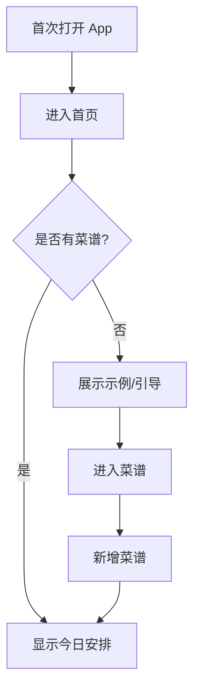
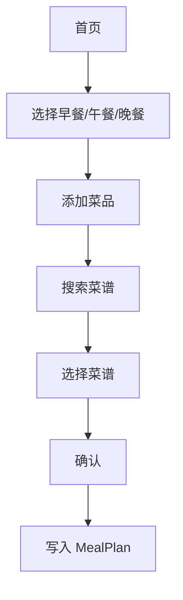
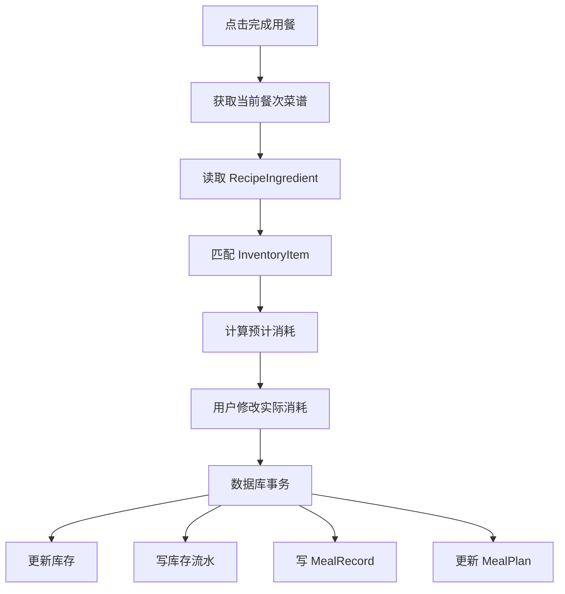
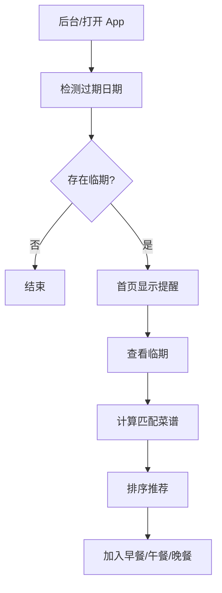

# 03｜用户流程与业务流程

## 1. 新用户首次使用



## 2. 添加菜谱


## 3. 添加库存


## 4. 手动点菜



## 5. 完成用餐



## 6. 临期推荐



## 7. 智能推荐规则流程

```text
查询有效库存
   ↓
查询有效菜谱
   ↓
对每个菜谱计算：
  ① 库存匹配率
  ② 临期命中数
  ③ 收藏状态
  ④ 最近食用情况
  ⑤ 制作时间
   ↓
计算总分
   ↓
过滤过度重复菜品
   ↓
按分数降序
   ↓
展示 Top N
```

## 8. 核心异常流程

### 8.1 库存不足

允许点菜，显示警告。

### 8.2 菜谱没有食材

允许保存，但不能参与库存匹配与自动扣减。

### 8.3 库存数量为 0

自动归档库存记录，但保留库存流水。

### 8.4 删除菜谱

菜谱主记录可归档；历史 MealRecord 不删除。

### 8.5 修改库存

所有手动调整必须写 InventoryTransaction。

## 9. 一次“吃饭”完整时序

```text
用户
 │
 ├─ 打开首页
 │
 ├─ 查看午餐
 │
 ├─ 点击完成用餐
 │
 ├─ 确认实际消耗
 │
 ▼
CompleteMealUseCase
 │
 ├─ 读取 MealPlan
 ├─ 读取 RecipeIngredient
 ├─ 匹配 InventoryItem
 ├─ 开启 DB Transaction
 │    ├─ 更新库存
 │    ├─ 写流水
 │    ├─ 创建 MealRecord
 │    └─ 更新 MealPlan
 │
 ▼
首页重新计算临期与推荐
```
