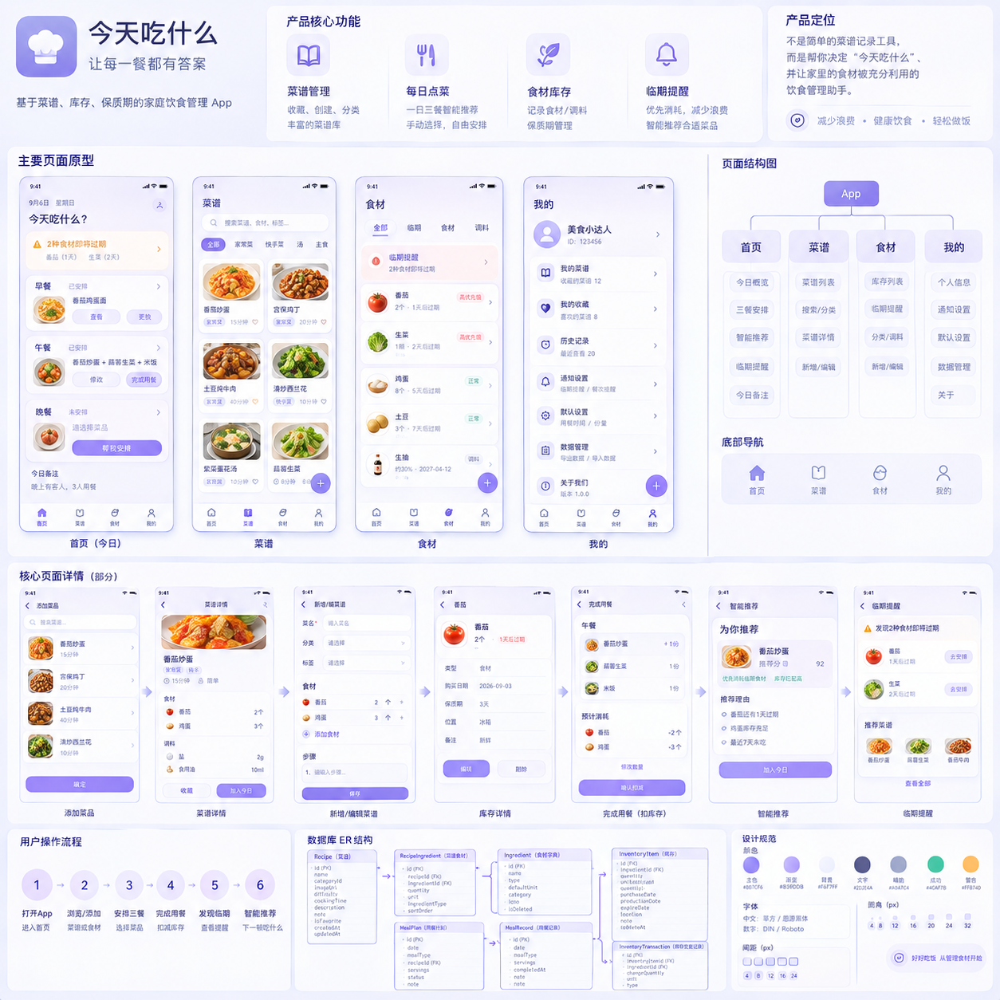

**今天吃什么**

食谱 × 三餐 × 库存 × 临期提醒

第一版产品方案 · PRD · 页面结构 · 用户流程 · Room ER 设计

<table>
<colgroup>
<col style="width: 100%" />
</colgroup>
<thead>
<tr class="header">
<th>
<strong>产品一句话定位</strong>

不是简单的菜谱记录工具，而是帮助用户决定“今天吃什么”，并把家里的食材优先吃掉。
</th>
</tr>
</thead>
<tbody>
</tbody>
</table>

| **核心模块** | **用户要解决的问题** | **V1 核心输出**                             |
|--------------|----------------------|---------------------------------------------|
| 首页         | 今天吃什么？         | 早餐 / 午餐 / 晚餐 + 点菜 + 推荐 + 今日备注 |
| 菜谱         | 我会做什么？         | 个人菜谱库、搜索、分类、标签、收藏、详情    |
| 食材         | 家里有什么？         | 库存、数量、保质期、临期、消耗记录          |
| 我的         | 怎么管理设置？       | 通知、默认设置、数据导出/恢复、关于         |

文档版本：V1.0　\|　产品状态：MVP 设计冻结前　\|　目标平台：Android

# 目录

| **章节** | **内容**                   |
|----------|----------------------------|
| 01       | 产品定义与目标             |
| 02       | 目标用户与使用场景         |
| 03       | V1 功能范围与优先级        |
| 04       | 信息架构与页面结构         |
| 05       | 首页 / 点菜 PRD            |
| 06       | 菜谱 PRD                   |
| 07       | 食材与库存 PRD             |
| 08       | 我的 / 设置 PRD            |
| 09       | 核心用户流程               |
| 10       | 核心业务规则               |
| 11       | Room 数据库 ER 结构        |
| 12       | UI 设计系统                |
| 13       | 推荐算法与通知策略         |
| 14       | Android 技术边界与开发计划 |
| 15       | V1 验收标准与后续路线      |

# 01 产品定义与目标

## 1.1 产品定位

“今天吃什么”是一款面向个人/家庭日常饮食场景的 Android 应用，围绕“今天吃什么”建立菜谱、三餐计划、食材库存与临期提醒之间的闭环。

## 1.2 核心价值主张

<table>
<colgroup>
<col style="width: 100%" />
</colgroup>
<thead>
<tr class="header">
<th>我有什么食材 
↓ 
我能做什么菜 
↓ 
今天吃什么 
↓ 
吃完消耗什么 
↓ 
什么快过期 
↓ 
下一顿优先吃什么</th>
</tr>
</thead>
<tbody>
</tbody>
</table>

## 1.3 产品北极星指标

建议不以“收藏了多少菜谱”为核心，而以“用户一个月内通过 App 完成了多少顿饭的决策”衡量产品是否真正解决问题。

<table>
<colgroup>
<col style="width: 100%" />
</colgroup>
<thead>
<tr class="header">
<th>
<strong>V1 产品目标</strong>

让用户打开 App 后，1 分钟内完成一顿饭的安排；吃完后可在最少操作下更新库存；临期食材能够进入首页并参与推荐。
</th>
</tr>
</thead>
<tbody>
</tbody>
</table>

# 02 目标用户与场景

| **用户类型**  | **典型需求**                   | **产品价值**                     |
|---------------|--------------------------------|----------------------------------|
| 独居/单身用户 | 懒得每天想吃什么、食材容易忘记 | 快速安排一人食并降低浪费         |
| 情侣/夫妻     | 需要一起决定三餐、共享库存     | 把“今晚吃什么”从口头讨论变成计划 |
| 家庭用户      | 食材多、临期多、晚餐人数变化   | 统一记录库存与家庭用餐安排       |
| 喜欢做饭的人  | 菜谱多、收藏多、难以组织       | 建立自己的长期菜谱资产           |

## 2.1 主要使用场景

- 打开 App，先看今天三餐是否已安排。

- 家里买了番茄、鸡蛋等食材，录入库存并设置保质期。

- 午餐想换一道菜，从个人菜谱搜索并加入餐次。

- 晚上完成用餐，确认实际消耗，库存自动减少。

- 发现番茄明天过期，首页提示并推荐能消耗番茄的菜。

# 03 V1 功能范围与优先级

| **优先级** | **功能**                  | **是否 V1** | **说明**               |
|------------|---------------------------|-------------|------------------------|
| P0         | 底部导航 + 四大页面       | 是          | 产品基本骨架           |
| P0         | 三餐计划 / 点菜           | 是          | 首页核心场景           |
| P0         | 菜谱 CRUD / 搜索 / 详情   | 是          | 点菜的数据来源         |
| P0         | 库存 CRUD / 数量 / 保质期 | 是          | 库存管理核心           |
| P0         | 完成用餐 + 扣库存         | 是          | 形成产品闭环           |
| P0         | 临期识别 + 首页提醒       | 是          | 降低食材浪费           |
| P1         | 随机推荐                  | 建议        | 低成本提升使用频率     |
| P1         | 库存匹配推荐              | 建议        | 形成“有什么做什么”能力 |
| P1         | 收藏 / 分类 / 标签        | 建议        | 提升菜谱长期可用性     |
| P1         | 库存流水                  | 建议        | 支持可追溯和撤销       |
| P1         | 本地通知                  | 建议        | 主动提醒临期           |
| P2         | 账号 / 云同步             | 否          | 后续再做               |
| P2         | 家庭共享                  | 否          | 后续再做               |
| P2         | 采购清单 / AI / 营养分析  | 否          | 产品验证后再扩展       |

<table>
<colgroup>
<col style="width: 100%" />
</colgroup>
<thead>
<tr class="header">
<th>
<strong>边界原则</strong>

V1 不做“功能很多的生活平台”，只做一个完整而稳定的闭环：菜谱 → 点菜 → 用餐 → 库存扣减 → 临期 → 推荐。
</th>
</tr>
</thead>
<tbody>
</tbody>
</table>

# 04 信息架构与页面结构

## 4.1 一级导航

<table>
<colgroup>
<col style="width: 100%" />
</colgroup>
<thead>
<tr class="header">
<th>App 
├── 首页 Home 
├── 菜谱 Recipe 
├── 食材 Inventory 
└── 我的 Profile</th>
</tr>
</thead>
<tbody>
</tbody>
</table>

## 4.2 页面树

<table>
<colgroup>
<col style="width: 100%" />
</colgroup>
<thead>
<tr class="header">
<th>首页 
├── 今日日期 
├── 临期提醒 
├── 早餐 
├── 午餐 
├── 晚餐 
├── 今日备注 
└── 推荐 / 添加菜品 
 
菜谱 
├── 搜索 
├── 分类 / 标签 
├── 菜谱列表 
├── 菜谱详情 
└── 新增 / 编辑菜谱 
 
食材 
├── 全部 
├── 临期 
├── 食材 
├── 调料 
├── 库存详情 
└── 新增 / 编辑库存 
 
我的 
├── 个人信息 
├── 通知设置 
├── 默认设置 
├── 数据管理 
└── 关于</th>
</tr>
</thead>
<tbody>
</tbody>
</table>

## 4.3 页面路由建议

| **路由**            | **页面**      | **主要入口**       |
|---------------------|---------------|--------------------|
| home                | 首页          | 底部导航           |
| meal/:date/:type    | 餐次/点菜     | 首页早餐/午餐/晚餐 |
| recipe              | 菜谱列表      | 底部导航           |
| recipe/:id          | 菜谱详情      | 菜谱列表 / 点菜    |
| recipe/edit/:id?    | 新增/编辑菜谱 | 菜谱列表 / 详情    |
| inventory           | 食材列表      | 底部导航           |
| inventory/:id       | 库存详情      | 库存列表           |
| inventory/edit/:id? | 新增/编辑库存 | 库存列表           |
| recommend           | 智能推荐      | 首页               |
| consume-confirm     | 完成用餐确认  | 首页餐次           |
| profile             | 我的          | 底部导航           |
| settings            | 设置          | 我的               |

# 05 首页 / 点菜 PRD

## 5.1 页面目标

用户进入 App 第一眼看到“今天吃什么”，而不是内容流。首页需要兼顾“查看今日安排”“临期提醒”“快速点菜”三件事。

## 5.2 首页结构

| **区域** | **内容**               | **交互**                |
|----------|------------------------|-------------------------|
| 顶部     | 日期、通知入口         | 切换日期 / 查看提醒     |
| 库存提醒 | 临期食材数量           | 进入临期列表 / 一键推荐 |
| 早餐     | 菜品卡片               | 查看、换菜、完成        |
| 午餐     | 菜品卡片               | 查看、换菜、完成        |
| 晚餐     | 菜品卡片               | 查看、换菜、完成        |
| 备注     | 今日备注               | 编辑文本                |
| 快捷操作 | 添加菜品 / 随机 / 推荐 | 进入点菜流程            |

## 5.3 点菜规则

- 每个餐次可添加多个菜品。

- 同一道菜可在不同日期重复出现。

- 库存不足不阻止点菜，但应给出提示。

- 点菜的数据来源默认是个人菜谱库，不直接创建“无来源菜品”。

- 用户可手动选择，也可以使用随机推荐或库存匹配推荐。

## 5.4 首页状态

| **状态** | **显示**       | **主要行动**           |
|----------|----------------|------------------------|
| 空状态   | 今天还没有安排 | 帮我安排 / 去菜谱      |
| 已安排   | 显示对应菜品   | 查看 / 更换 / 完成用餐 |
| 临期     | 顶部显示提醒条 | 查看 / 优先安排        |
| 库存不足 | 菜品下方提示   | 继续安排 / 去库存      |

# 06 菜谱 PRD

## 6.1 菜谱模型

| **字段组** | **内容**                                 |
|------------|------------------------------------------|
| 基本信息   | 菜名、封面图、分类、标签、难度、制作时间 |
| 食材       | 食材名称、数量、单位、备注               |
| 调料       | 调料名称、数量、单位、备注               |
| 步骤       | 步骤序号、文本 / 可选图片                |
| 用户属性   | 收藏、归档、创建时间、更新时间           |

## 6.2 菜谱详情页结构

<table>
<colgroup>
<col style="width: 100%" />
</colgroup>
<thead>
<tr class="header">
<th>菜谱封面 
菜名 / 分类 / 难度 / 时间 
收藏 ☆ 
 
食材 
番茄 2个 
鸡蛋 3个 
 
调料 
盐 2g 
油 10ml 
 
制作步骤 
1. ... 
2. ... 
 
备注 
 
[编辑] [加入早餐/午餐/晚餐]</th>
</tr>
</thead>
<tbody>
</tbody>
</table>

## 6.3 菜谱维护原则

- 菜谱删除建议使用归档而非物理删除，以保留历史用餐记录。

- 菜谱允许没有食材明细，但这类菜谱不能参与库存匹配，也不能自动扣库存。

- 食材必须引用标准 Ingredient，而不是在菜谱中自由写字符串，以保证库存关联。

# 07 食材与库存 PRD

## 7.1 食材与库存的两个概念

Ingredient 表示“番茄”这个标准食材对象；InventoryItem 表示“我当前拥有的一批番茄”。两者分离后，可以支持不同批次、不同保质期。

## 7.2 库存页面

| **区域** | **功能**                                     |
|----------|----------------------------------------------|
| 筛选     | 全部 / 临期 / 食材 / 调料                    |
| 库存卡片 | 名称、当前数量、单位、保质期、状态           |
| 库存详情 | 购买日期、生产日期、过期日期、存放位置、备注 |
| 操作     | 新增、编辑、消耗、归档                       |

## 7.3 数量策略

V1 采用“半精确库存”：默认支持数字数量，但允许少量 / 适量 / 充足等模糊状态，避免用户每次做饭都必须精确称重。

## 7.4 临期规则

| **状态** | **建议定义**       | **UI 表现**         |
|----------|--------------------|---------------------|
| 已过期   | expireDate \< 今天 | 高风险提示          |
| 紧急     | 0~1 天             | 强提醒              |
| 临期     | 2~3 天             | 首页提醒 + 推荐加分 |
| 正常     | \>3 天             | 常规展示            |

# 08 我的 / 设置 PRD

| **设置项** | **V1 方案**                    |
|------------|--------------------------------|
| 账号       | 不强制登录，本地使用           |
| 通知       | 是否开启临期提醒；提醒提前天数 |
| 默认设置   | 默认三餐时间、默认份量         |
| 数据管理   | 导出 / 恢复本地数据            |
| 关于       | 版本号、说明、隐私政策入口     |

<table>
<colgroup>
<col style="width: 100%" />
</colgroup>
<thead>
<tr class="header">
<th>
<strong>账号策略</strong>

V1 不接入账号系统。只有当“跨设备同步 / 家庭共享 / 云备份”成为真实需求后，再引入账号与后端。
</th>
</tr>
</thead>
<tbody>
</tbody>
</table>

# 09 核心用户流程

## 9.1 首次使用

<table>
<colgroup>
<col style="width: 100%" />
</colgroup>
<thead>
<tr class="header">
<th>打开 App 
↓ 
进入首页 
↓ 
发现今天暂无安排 
↓ 
系统提供示例菜谱 
↓ 
选择早餐 / 午餐 / 晚餐 
↓ 
完成第一次点菜</th>
</tr>
</thead>
<tbody>
</tbody>
</table>

## 9.2 新增菜谱

| 菜谱 → ＋ → 基本信息 → 添加食材/调料 → 添加步骤 → 保存 → 菜谱详情 |
|-------------------------------------------------------------------|

## 9.3 新增库存

| 食材 → ＋ → 选择/创建 Ingredient → 数量/单位 → 过期日期 → 保存 → 库存列表 |
|---------------------------------------------------------------------------|

## 9.4 完成用餐

| 首页 → 晚餐 → 完成用餐 → 显示预计消耗 → 用户调整 → 确认 → 更新库存 → 写入库存流水 → 生成用餐记录 |
|--------------------------------------------------------------------------------------------------|

## 9.5 临期驱动点菜

<table>
<colgroup>
<col style="width: 100%" />
</colgroup>
<thead>
<tr class="header">
<th>首页临期提醒 
↓ 
查看临期食材 
↓ 
点击“优先安排” 
↓ 
按库存匹配 + 临期加分排序 
↓ 
选择推荐菜 
↓ 
加入下一顿</th>
</tr>
</thead>
<tbody>
</tbody>
</table>

# 10 核心业务规则

| **规则** | **产品定义**                                                   |
|----------|----------------------------------------------------------------|
| R01      | 一个餐次可包含多个菜品。                                       |
| R02      | 点菜允许库存不足，不阻塞用户决策。                             |
| R03      | 完成用餐才触发库存扣减。                                       |
| R04      | 扣库存必须记录 InventoryTransaction。                          |
| R05      | 扣库存支持用户修改实际消耗量。                                 |
| R06      | 完成用餐、库存更新、流水写入应在同一事务中执行。               |
| R07      | 菜谱删除不影响历史 MealRecord。                                |
| R08      | 临期状态由 expireDate 动态计算，不建议作为冗余字段长期存储。   |
| R09      | 库存可以多批次存在，同一 Ingredient 可对应多个 InventoryItem。 |
| R10      | 没有食材明细的菜谱仍可点菜，但不参与库存扣减。                 |

# 11 Room 数据库 ER 结构

## 11.1 ER 总体关系

<table>
<colgroup>
<col style="width: 100%" />
</colgroup>
<thead>
<tr class="header">
<th>Recipe 1 ───── N RecipeIngredient N ───── 1 Ingredient 
│ │ 
│ └──── N InventoryItem 
│ │ 
│ └──── N InventoryTransaction 
│ 
└──── N MealPlan ───── 0..1 MealRecord 
 
Recipe N ───── N Tag 
\ / 
\ RecipeTag 
 
Recipe N ───── 1 Category</th>
</tr>
</thead>
<tbody>
</tbody>
</table>

## 11.2 核心表

| **表**                | **主键**       | **核心字段**                                                                   | **说明**        |
|-----------------------|----------------|--------------------------------------------------------------------------------|-----------------|
| recipe                | id             | name, imageUri, categoryId, difficulty, cookingTimeMin, isFavorite, isArchived | 菜谱主表        |
| ingredient            | id             | name, type, defaultUnit, category, isDeleted                                   | 标准食材字典    |
| recipe_ingredient     | id             | recipeId, ingredientId, quantity, unit, ingredientType, sortOrder              | 菜谱-食材关联   |
| inventory_item        | id             | ingredientId, quantity, unit, expireDate, location, isDeleted                  | 库存批次        |
| inventory_transaction | id             | inventoryItemId, changeQuantity, type, sourceType, sourceId                    | 库存流水        |
| meal_plan             | id             | date, mealType, recipeId, servings, status, sortOrder                          | 未来/当天吃什么 |
| meal_record           | id             | date, mealType, servings, completedAt, note                                    | 实际用餐记录    |
| category              | id             | name, sortOrder, icon                                                          | 菜谱分类        |
| tag                   | id             | name, sortOrder                                                                | 菜谱标签        |
| recipe_tag            | recipeId+tagId | recipeId, tagId                                                                | 多对多关联      |
| app_setting           | key            | key, value                                                                     | 本地设置 KV     |

## 11.3 推荐的 Java Entity 命名

<table>
<colgroup>
<col style="width: 100%" />
</colgroup>
<thead>
<tr class="header">
<th>RecipeEntity 
IngredientEntity 
RecipeIngredientEntity 
InventoryItemEntity 
InventoryTransactionEntity 
MealPlanEntity 
MealRecordEntity 
CategoryEntity 
TagEntity 
RecipeTagCrossRef 
AppSettingEntity</th>
</tr>
</thead>
<tbody>
</tbody>
</table>

## 11.4 关键 Room Relation

<table>
<colgroup>
<col style="width: 100%" />
</colgroup>
<thead>
<tr class="header">
<th>RecipeWithIngredients 
RecipeEntity recipe 
List&lt;RecipeIngredientWithIngredient&gt; ingredients 
 
InventoryWithIngredient 
InventoryItemEntity inventory 
IngredientEntity ingredient</th>
</tr>
</thead>
<tbody>
</tbody>
</table>

# 12 UI 设计系统

## 12.1 视觉方向

采用低饱和紫渐变为品牌主视觉，整体偏“柔和、干净、家庭感、轻工具化”。避免高饱和紫色大面积铺底；紫色主要用于重点操作、选中态、渐变标题和状态强调。

| **Token**           | **建议值** | **用途**               |
|---------------------|------------|------------------------|
| color.primary       | \#7C68E8   | 主按钮、选中态、强调   |
| color.primaryDark   | \#4B3F8F   | 标题、重要文字         |
| color.primarySoft   | \#F2EEFF   | 浅色卡片背景、选中背景 |
| color.accentStart   | \#AFA3F7   | 渐变起点               |
| color.accentEnd     | \#7C68E8   | 渐变终点               |
| color.surface       | \#FFFFFF   | 卡片 / 页面主表面      |
| color.background    | \#FAF9FD   | 全局页面背景           |
| color.textPrimary   | \#242238   | 正文                   |
| color.textSecondary | \#6E6A7D   | 辅助文字               |
| color.border        | \#E5E0F0   | 分割线 / 边框          |

## 12.2 排版变量

| **Token**         | **建议值**      | **用途**        |
|-------------------|-----------------|-----------------|
| text.pageTitle    | 24sp / Bold     | 页面主标题      |
| text.sectionTitle | 18sp / Bold     | 模块标题        |
| text.cardTitle    | 15sp / SemiBold | 卡片标题        |
| text.body         | 14sp / Regular  | 正文            |
| text.secondary    | 12sp / Regular  | 辅助信息        |
| text.caption      | 11sp / Regular  | 标签 / 次要信息 |

## 12.3 间距变量

| **Token**  | **值** | **说明**             |
|------------|--------|----------------------|
| space.xs   | 4dp    | 图标与文字等紧凑关系 |
| space.sm   | 8dp    | 标签、按钮内部关系   |
| space.md   | 12dp   | 卡片内部基础间距     |
| space.lg   | 16dp   | 页面主间距           |
| space.xl   | 20dp   | 区块间距             |
| space.xxl  | 24dp   | 大区块分隔           |
| space.xxxl | 32dp   | 页面级留白           |

## 12.4 圆角变量

| **Token**   | **值** | **使用**          |
|-------------|--------|-------------------|
| radius.sm   | 8dp    | 标签 / 小控件     |
| radius.md   | 12dp   | 普通卡片 / 输入框 |
| radius.lg   | 16dp   | 主要卡片          |
| radius.xl   | 20dp   | 首页大卡片        |
| radius.pill | 999dp  | Chip / 胶囊按钮   |

## 12.5 组件统一原则

- 所有页面使用统一的设计 Token，不在单个页面中随意写颜色、间距和圆角。

- 主操作按钮统一使用紫渐变；次操作使用白底紫边或浅紫底。

- 卡片统一白底、轻阴影、16dp 左右圆角；避免过重阴影。

- 危险状态使用低饱和红色；临期提示优先使用柔和橙色/红色。

- 底部导航保持固定高度与统一 icon 风格，选中态使用紫色。

**V1 页面原型 / 功能架构参考图**

注：该图用于展示首页、菜谱、食材、我的四大页面及核心流程的统一低饱和紫 UI 方向。

# 13 推荐算法与通知策略

## 13.1 V1 推荐不依赖 AI

第一版推荐使用规则评分即可，先验证“库存驱动吃饭”这个产品价值，再决定是否引入 AI。

<table>
<colgroup>
<col style="width: 100%" />
</colgroup>
<thead>
<tr class="header">
<th>score = 
inventoryMatch * 50 
+ expiringMatch * 40 
+ favoriteBonus * 10 
+ notRecentlyEaten * 10 
- recentRepeat * 30</th>
</tr>
</thead>
<tbody>
</tbody>
</table>

## 13.2 推荐因素

| **因素** | **含义**                 | **建议权重** |
|----------|--------------------------|--------------|
| 库存匹配 | 当前库存是否覆盖所需食材 | 高           |
| 临期匹配 | 是否能消耗即将过期食材   | 最高         |
| 收藏     | 用户明确喜欢             | 中           |
| 最近未吃 | 减少连续重复             | 低           |
| 近期重复 | 近几天反复出现则降权     | 中           |
| 制作时长 | 工作日可适当偏好快手菜   | 低           |

## 13.3 通知

- 用户主动开启临期提醒后，每天最多一次汇总通知，避免骚扰。

- 通知内容尽量给出下一步行动，例如“番茄明天到期，可考虑番茄炒蛋”。

- 首页通知优先于系统通知，系统通知是补充而不是主入口。

# 14 Android 技术边界与开发计划

## 14.1 推荐架构

<table>
<colgroup>
<col style="width: 100%" />
</colgroup>
<thead>
<tr class="header">
<th>UI / Activity / Fragment / Compose Screen 
↓ 
ViewModel 
↓ 
UseCase / Repository 
↓ 
Room DAO 
↓ 
SQLite 本地数据库</th>
</tr>
</thead>
<tbody>
</tbody>
</table>

Java 技术栈可采用 Android + Room + ViewModel + Repository。无后端的 V1 使用本地数据库完成全部核心功能。若后续接入云同步，再把 Repository 替换/扩展为本地 + 远程双数据源。

## 14.2 推荐项目包结构

<table>
<colgroup>
<col style="width: 100%" />
</colgroup>
<thead>
<tr class="header">
<th>com.example.mealplanner 
├── data 
│ ├── local 
│ │ ├── dao 
│ │ ├── entity 
│ │ └── AppDatabase.java 
│ ├── repository 
│ └── mapper 
├── domain 
│ ├── model 
│ ├── repository 
│ └── usecase 
├── ui 
│ ├── home 
│ ├── recipe 
│ ├── inventory 
│ └── profile 
├── notification 
└── MainActivity.java</th>
</tr>
</thead>
<tbody>
</tbody>
</table>

## 14.3 核心 UseCase

| **UseCase**                 | **职责**                               |
|-----------------------------|----------------------------------------|
| CreateRecipeUseCase         | 新增菜谱及其食材/调料关联              |
| UpdateRecipeUseCase         | 编辑菜谱                               |
| AddInventoryUseCase         | 新增库存批次                           |
| AdjustInventoryUseCase      | 人工调整库存                           |
| CreateMealPlanUseCase       | 安排三餐                               |
| CompleteMealUseCase         | 完成用餐并扣库存 + 记流水 + 写用餐记录 |
| RecommendRecipesUseCase     | 根据库存/临期/历史进行排序             |
| GetExpiringInventoryUseCase | 查询临期库存                           |

## 14.4 开发顺序

1.  创建 Room 数据库、Entity、DAO。

2.  完成菜谱 CRUD 和菜谱详情。

3.  完成库存 CRUD、保质期和临期列表。

4.  完成首页三餐计划和点菜。

5.  实现 CompleteMealUseCase：实际消耗 → 库存扣减 → 流水 → 用餐记录。

6.  加入规则推荐和首页临期提醒。

7.  最后处理通知、数据导出/恢复和设置。

# 15 V1 验收标准与后续路线

## 15.1 V1 核心验收场景

8.  创建“番茄炒蛋”菜谱，食材设置为番茄 2 个、鸡蛋 3 个。

9.  新增库存：番茄 4 个、鸡蛋 8 个。

10. 首页午餐加入番茄炒蛋。

11. 点击“完成用餐”，系统显示预计消耗并允许修改。

12. 确认后库存变成番茄 2 个、鸡蛋 5 个，并产生库存流水。

13. 设置番茄为明天过期，首页出现临期提醒。

14. 点击“优先安排”，推荐结果中与番茄匹配的菜谱获得明显加分。

15. 查看历史用餐记录时，即使菜谱已经归档，历史记录仍然可见。

## 15.2 关键质量标准

| **维度** | **V1 要求**                                                                       |
|----------|-----------------------------------------------------------------------------------|
| 可用性   | 核心流程 1 分钟内可完成；空状态清晰。                                             |
| 一致性   | 所有页面颜色、字体、间距、圆角统一使用 Design Token。                             |
| 可靠性   | 完成用餐的库存变更必须具备事务一致性。                                            |
| 数据安全 | V1 数据默认本地保存；导出/恢复可选。                                              |
| 扩展性   | Ingredient / Recipe / Inventory / MealPlan 关系稳定，为 V2 云同步和家庭模式预留。 |

## 15.3 后续版本路线

| **版本** | **重点**                                    |
|----------|---------------------------------------------|
| V1.0     | 个人饮食管理闭环：菜谱 + 三餐 + 库存 + 临期 |
| V1.5     | 智能推荐、库存匹配、采购清单                |
| V2.0     | 账号、云同步、家庭空间、共享库存            |
| V2.5     | 家庭采购助手、食材消耗统计、更多自动化      |
| V3.0     | AI 菜谱 / AI 点菜 / 营养分析等智能能力      |

<table>
<colgroup>
<col style="width: 100%" />
</colgroup>
<thead>
<tr class="header">
<th>
<strong>最终产品闭环</strong>

菜谱回答“我会做什么”；食材回答“家里有什么”；首页回答“今天吃什么”；临期提醒回答“什么应该先吃”。四者连接起来，才是这个 App 的核心价值。
</th>
</tr>
</thead>
<tbody>
</tbody>
</table>

# 附录：V1 产品基线（开发前冻结清单）

- 一级导航：仅保留 首页 / 菜谱 / 食材 / 我的。

- V1 默认本地使用，不依赖登录。

- 库存可多批次；Ingredient 与 InventoryItem 分离。

- 餐次支持多菜；完成用餐才扣库存。

- 扣库存必须产生流水记录，并支持手动修正。

- 临期状态由过期日期动态计算。

- 推荐先用规则算法，不先引入 AI。

- 紫渐变、颜色、字体、间距、圆角统一通过 Design Token 管理。
